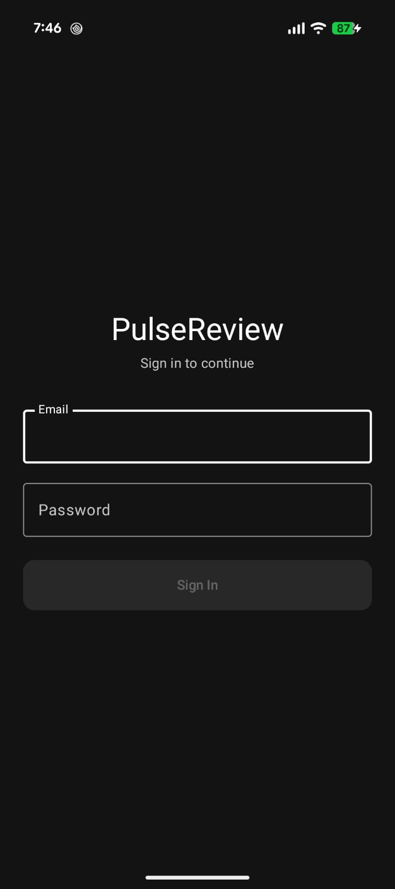
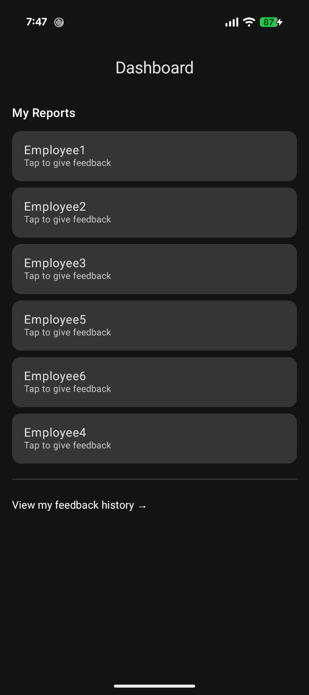
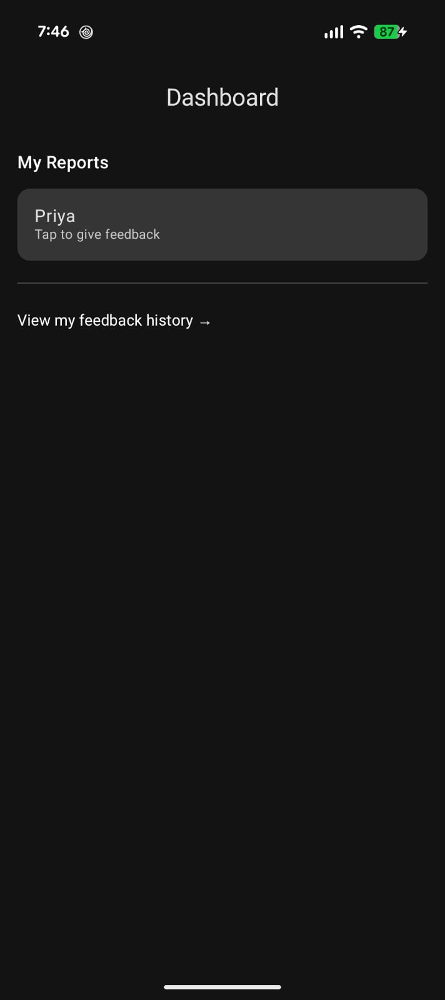
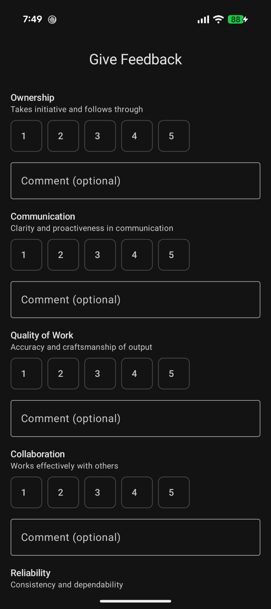
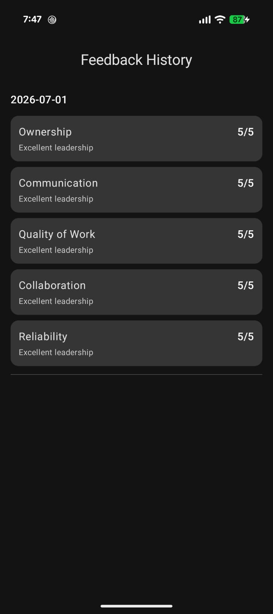

<p align="center">
  
</p>

<h1 align="center">PulseReview</h1>

<p align="center">
  <i>A multi-tenant monthly performance feedback platform for managers, employees, and HR</i>
</p>

<p align="center">
  
  
  
  
</p>

---

## Overview

PulseReview is a multi-tenant employee performance review platform built for modern organizations. Managers provide structured monthly feedback across 5 fixed parameters for their direct reports, while employees track their historical ratings over time. The same platform supports multiple isolated companies and allows an individual to simultaneously act as a manager to some and a report to another.

---

## Features

- **Role-Flexible Feedback:** Supports contextual relationships where a single user can simultaneously serve as a manager (reviewer) for direct reports and an employee (reviewee) for their superior.
- **Multi-Tenant Company Isolation:** Complete data separation across tenants enforced by PostgreSQL Row Level Security (RLS).
- **Monthly Feedback Cycles:** Standardized monthly evaluation rounds covering 5 fixed rating parameters.
- **Duplicate-Submission Prevention:** Pre-submission checks prevent multiple reviews per cycle, rendering a read-only view of existing scores if already submitted.
- **HR Submission Tracking Dashboard:** Company-wide review completion tracking with live completion status indicators.
- **Employee Score History:** Historical performance tracking grouped by period, preserving records across past review cycles.

---

## Screenshots

<table>
  <tr>
    <td align="center" width="50%">
      <br/>
      <b>Splash Screen</b>
    </td>
    <td align="center" width="50%">
      <br/>
      <b>Login Screen</b>
    </td>
  </tr>
  <tr>
    <td align="center" width="50%">
      <br/>
      <b>Manager Dashboard — Priya, 6 direct reports</b>
    </td>
    <td align="center" width="50%">
      <br/>
      <b>Employee Dashboard — Rohan, reports to Priya</b>
    </td>
  </tr>
  <tr>
    <td align="center" width="50%">
      <br/>
      <b>Give Feedback Form</b>
    </td>
    <td align="center" width="50%">
      <br/>
      <b>Feedback History, read-only</b>
    </td>
  </tr>
</table>

---

## Tech Stack

- **Language:** Kotlin
- **UI Framework:** Jetpack Compose, Material 3
- **Architecture:** MVVM, StateFlow, Coroutines
- **Navigation:** Navigation Compose (Type-safe `@Serializable` routes)
- **Backend:** Supabase (PostgreSQL, Supabase Auth, Row Level Security)
- **Networking & Serialization:** `supabase-kt`, Ktor Client, `kotlinx-serialization`

---

## Architecture & Data Model

Reporting relationships are modeled as dedicated graph edges in a `reporting_relationships` table (`manager_id` → `employee_id` with `active_from`/`active_to` dates) rather than a static `role` or `manager_id` column on the user record. This design decision enables one person to manage a team while reporting to a executive, and allows both flat and deeply hierarchical organizational structures to evolve over time without schema modifications.

---

## Assumptions

- **Relationship History:** Reporting relationships can change over time while historical feedback records remain preserved via `active_from` and `active_to` date bounds.
- **Feedback Cycles:** Feedback cycles are monthly and calendar-aligned.
- **HR Access Control:** HR access is scoped per company via a dedicated `hr_users` table rather than a fixed user role attribute.
- **Contextual Roles:** A user can hold manager and employee status simultaneously depending on reporting relationship context.
- **Data Security:** Row Level Security (RLS) enforces company isolation at the database layer.

---

## Setup

1. **Clone the repository:**
   ```bash
   git clone https://github.com/VaibhavGupta-1/PulseReview.git
   cd PulseReview
   ```

2. **Configure Supabase Credentials:**
   Add credentials to `local.properties`:
   ```properties
   SUPABASE_URL=https://your-supabase-project.supabase.co
   SUPABASE_KEY=your-supabase-anon-key
   ```

3. **Open in Android Studio:**
   Open project in Android Studio (Hedgehog or newer).

4. **Build & Run:**
   Run `./gradlew assembleDebug` or launch the application on an emulator or connected device.

---

## Download

📱 [Download APK](https://drive.google.com/file/d/1ctMjAncdgJMxPRwVDvgmeDh73-JXx2Ln/view?usp=drive_link)

